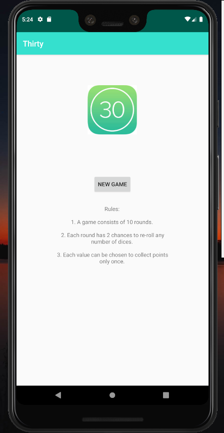
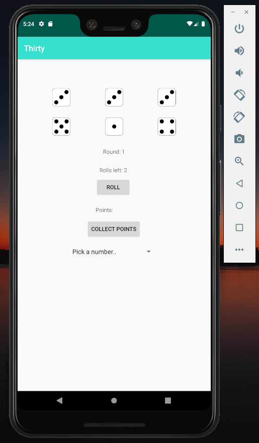

## Dice Game - Thirty

A Software Engineering project for the course 

<strong>Development of Mobile Applications (5DV209)</strong> at Umeå University. Summer 2019.

Made in Android Studio and written in Java.
#### Dependencies

Android API Level 19-28

#### Rules

        1. A game consists of 10 rounds.
        2. Each round has 2 chances to re-roll any number of dices.
        3. Each value can be chosen to collect points only once.
 
 
<strong>MainActivity</strong> 
 
<strong>GameActivity</strong> 
